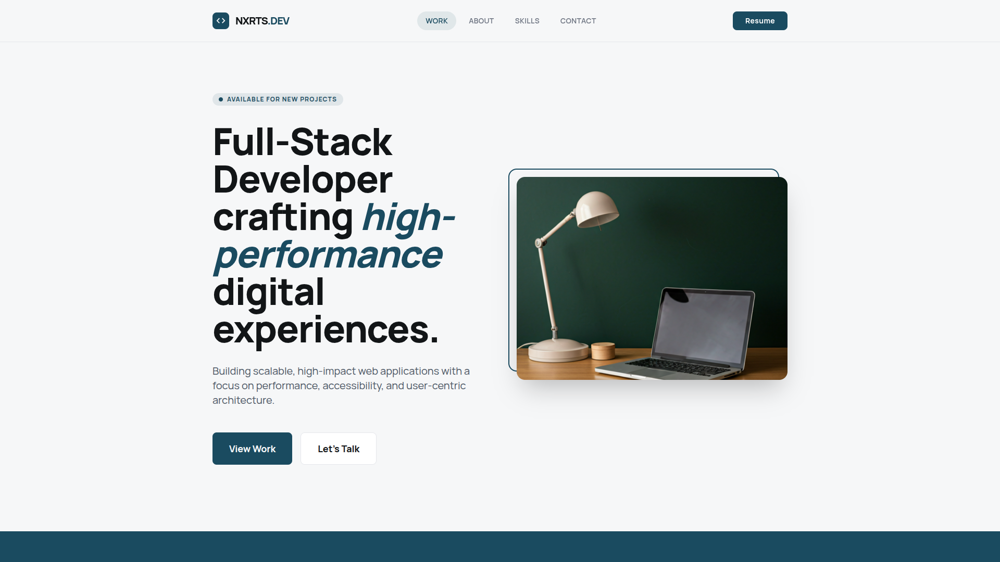

# NXRts.dev | Professional Code Portfolio



A high-performance, responsive, and animated portfolio website built for the modern web.  
Showcasing technical expertise with a clean, user-centric design.

## 🚀 Tech Stack

*   **Core:** [React 18](https://react.dev/), [TypeScript](https://www.typescriptlang.org/), [Vite](https://vitejs.dev/)
*   **Styling:** [Tailwind CSS](https://tailwindcss.com/)
*   **Animation:** [Framer Motion](https://www.framer.com/motion/)
*   **Icons:** [Google Material Symbols](https://fonts.google.com/icons)
*   **Fonts:** [Manrope](https://fonts.google.com/specimen/Manrope)

## ✨ Key Features

*   **⚡ Blazing Fast Performance:** Powered by Vite bundler/build tool.
*   **🎨 Glassmorphism UI:** Modern aesthetic with backdrop blur effects.
*   **🎭 Smooth Animations:**
    *   **Scroll & Reveal:** Elements fade and slide in as you explore.
    *   **Staggered Lists:** Project cards and skills load sequentially.
    *   **ScrollSpy Navbar:** Active link updates automatically based on scroll position.
    *   **Interactive Pill:** Smooth sliding background for navigation items.
*   **📱 Fully Responsive:** Optimized for all devices, from mobile phones to 4k desktops.
*   **♿ Accessible:** Semantic HTML structure and focus management.

## 🛠️ Installation & Setup

1.  **Clone the repository**
    ```bash
    git clone https://github.com/NXRts/DEVGALLERY.git
    cd DEVGALLERY
    ```

2.  **Install dependencies**
    ```bash
    npm install
    # or
    yarn install
    ```

3.  **Run the development server**
    ```bash
    npm run dev
    ```

4.  **Build for production**
    ```bash
    npm run build
    ```

## 📂 Project Structure

```text
src/
├── components/      # Reusable UI components
│   ├── Navbar.tsx   # Sticky header with ScrollSpy
│   ├── Hero.tsx     # Landing section
│   ├── Reveal.tsx   # Animation wrapper
│   └── ...
├── index.css        # Tailwind directives & global styles
├── App.tsx          # Main application layout
└── main.tsx         # Entry point
public/
├── vite.svg         # Favicon
└── NXRts-dev.png    # Preview Image
```

## 📄 License

This project is open-source and available under the [MIT License](LICENSE).

---

© 2026 NXRts.dev. Designed & Built with ❤️.
